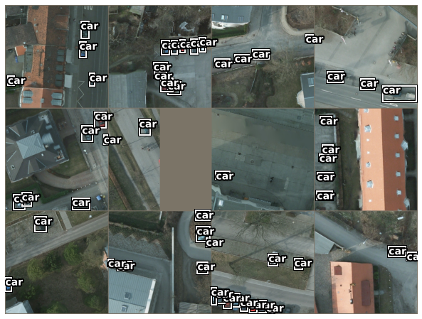
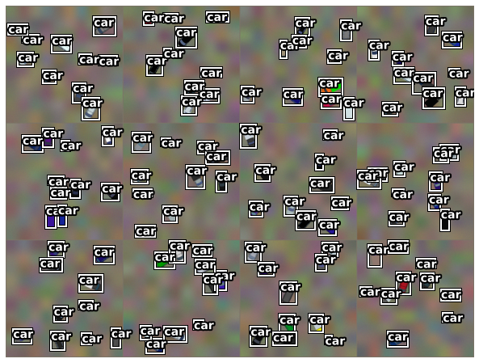
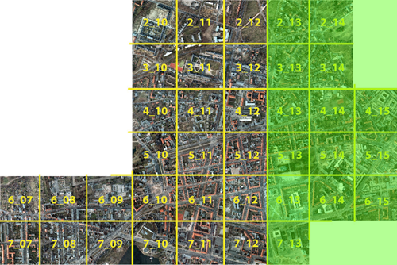

# ArtifiVe-Potsdam
tooling and demo for ArtifiVe-Potsdam (Artificial Vehicles) dataset
http://rs.ipb.uni-bonn.de/data/artifive-potsdam/


Please check the notebook to see how the code can be used to create a pytorch dataset, to prepare the data with transformations, and some visual samples of the dataset content.

## real (Potsdam) samples

based on ISPRS 2D Semantic Labeling Contest - Potsdam:



## artificial samples

based on blueprints:



## Installation

Download the content of the repository and run the following to install the requirments:

```
pip install -r requirements.txt
```
This installs all requirements with `pip`, except of `libjpeg-turbo`, which can easily be installed with:
```
conda install libjpeg-turbo -c conda-forge
```


## Dataset

* the annotations are provided as a single json file for each sub dataset called `annotations_*.json`
* the content is a list of json dictionary for each sample (image + annotations) in the dataset
* labels are stored in form of the class strings
* objects are stored in form of their bounding polygons and in WKT format, which can for example be converted using shapely's `shapely.geometry.shape()`
* a `is_difficult` flag is also contained, but is allways `false`


| dataset                            | training images | test images | training objects | test objects |
|------------------------------------|-----------------|-------------|------------------|--------------|
| fullsized                          | 24              | 14          | 6019             | 3833         |
| patched 600x600 px                 | 2400            | 1400        | 6978             | 4489         |
| patched 600x600 px+ 200 px overlap | 5400            | 3150        | 15379            | 9793         |
| artificial                         | 1000            |             | 10000            |              |

### Training + Test split

The split is based on the original ISPRS 2D Semantic Labeling Contest split. The green colored tiles are the test section.




## Requirements

* numpy https://github.com/numpy/numpy
* pytorch https://github.com/pytorch/pytorch
* torchvision https://github.com/pytorch/vision
* pillow https://github.com/python-pillow/Pillow
* shapely https://github.com/Toblerity/Shapely
* matplotlib https://matplotlib.org/
* optional: libjpeg-turbo https://github.com/libjpeg-turbo/libjpeg-turbo/ + https://github.com/lilohuang/PyTurboJPEG

 
## Benchmark details

### Training

* we train on patched/600x600_overlap200/training
* we split it into 70% for training and 30 % for validation, therefore the provided sample numbers in the paper are smaller than the actual number of images; also therfore your performance may vary
* we remove objects whose min and max sizes are outside of 20 and 200 px and require one side to be larger than 40 px
* we remove the empty images which further reduces the number of samples (`remove_empty` sample_filter)


### Testing

* we test on patched/600x600/test dataset
* we use pycocotools (https://github.com/cocodataset/cocoapi) to evaluate
* the baselines report the AP with IOU threshold 0.5